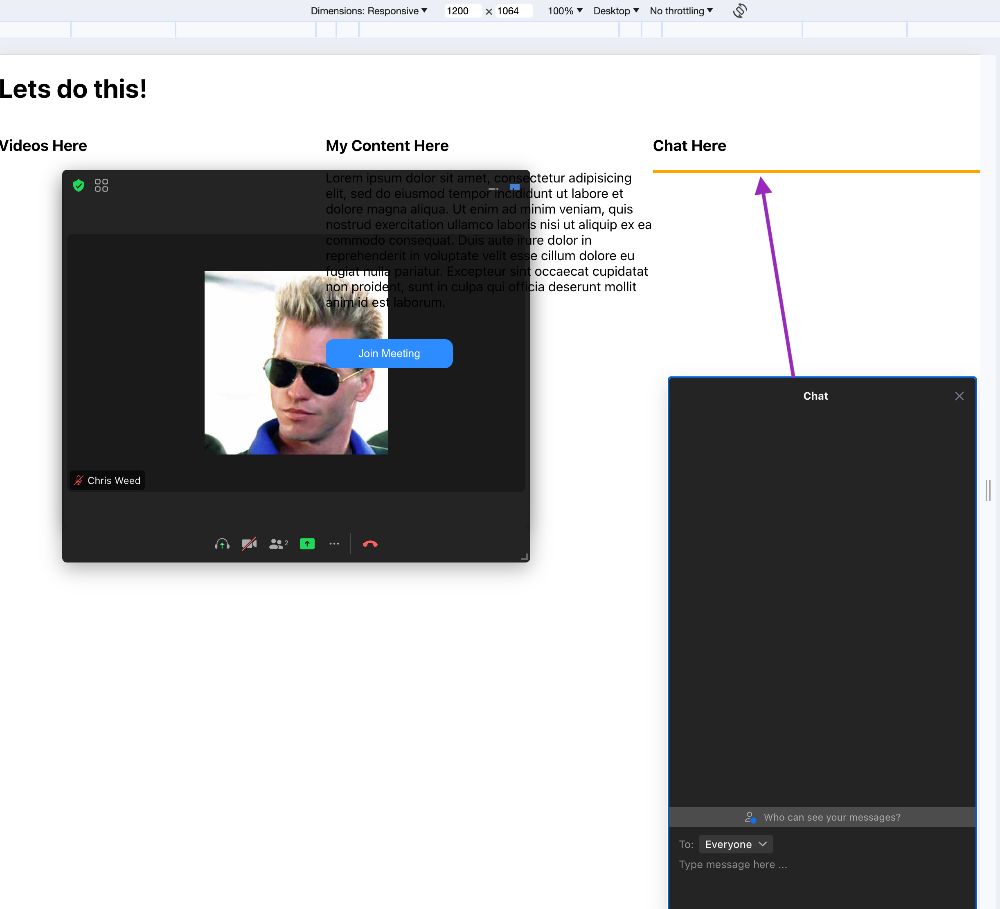

## Chat Positioning

This bug is around positioning of the chat popper window.  After following the instructions and playing around with the positioning of chat it still continues to not go where it's intended.

It seems that popper is thinking the window is too big to fit where I've designated it to go and shifts it to the top or bottom of the page.

The alignment vertically is correct and seems to work as desired.

Ignore the ugly sizing, as that's not implemented in this branch.  Resizing is another topic.

