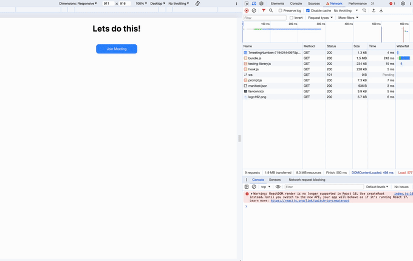

## Uncaught Exceptions

Using the baseline react sample app you can see there are several full-screen exceptions being thrown for somewhat muntaine errors such as "on hold".

I've tried many options to capture these exceptions but none seem to work.

1. Try/catch and `error` props.
2. ErrorBoundaries

## Setup

1. Start the react-auth-sample app on port 4000, start this app.
2. Create the url params: `http://localhost:3001/?meetingNumber=[meetingNumber]&password=[password]&userEmail=bill&sdkKey=[sdkKey]`
3. Reload and Join

It's also possible to join/create with zak
