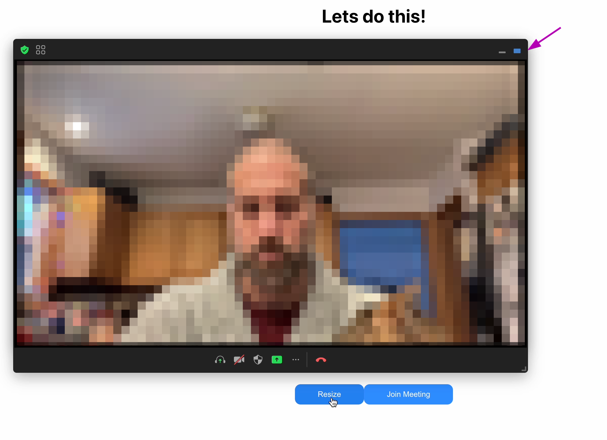

## Gallery View

This issue is around displaying the gallery view within the web components.

The resize button adjusts to a random size within the gallery specifications https://developers.zoom.us/docs/meeting-sdk/web/component-view/resizing/#sizing-components-at-init. However, as you can see in the attached video, it only displays the "speaker" view.

Notice that at the top right of the window it only allows for the small and large options (difficult to know what those blocks actually mean).  But it appears to switch between a "minified" view with no videos at all and the "single active speaker" view.

[out-2024-01-26_17-08-31.mp4](out-2024-01-26_17-08-31.mp4)

